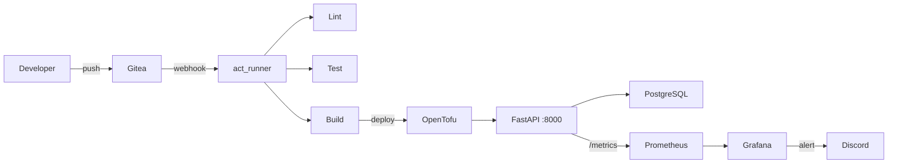

[](https://github.com/JulijZav/task-tracker/actions/workflows/ci.yml)

# Task Tracker — Self-Hosted CI/CD Portfolio

# Task Tracker — Self-Hosted CI/CD Portfolio

A task management API built with FastAPI and PostgreSQL, wrapped in a
full self-hosted DevOps pipeline: CI/CD, infrastructure as code,
monitoring, SLOs and incident management.

## Architecture



## Tech Stack

| Layer            | Tool                         |
|------------------|------------------------------|
| Application      | FastAPI, SQLAlchemy, Alembic |
| Database         | PostgreSQL 16                |
| Containerization | Docker, Docker Compose       |
| CI/CD            | Gitea Actions, act_runner    |
| IaC              | OpenTofu (Terraform fork)    |
| Orchestration    | k3s (lightweight Kubernetes) |
| Monitoring       | Prometheus, Grafana          |
| Alerting         | Grafana → Discord webhook    |
| Linting          | Ruff                         |
| Testing          | Pytest                       |

## Pipeline

Every push to `main` triggers a 4-stage pipeline:

1. **Lint** — Ruff checks code style and import ordering
2. **Test** — Pytest runs CRUD endpoint tests against SQLite
3. **Build** — Docker image is built and verified
4. **Deploy** — OpenTofu applies infrastructure changes

## SRE Practices

- **SLO**: 99.5% of requests return 2xx within a 5-minute window
- **Error budget**: tracked on Grafana gauge panel
- **Alerting**: Grafana fires Discord webhook when SLO is breached
- **Incident drill**: intentional database outage with full [postmortem](postmortem/)

## Kubernetes (k3s)

The application runs on a local k3s cluster managed by k3d:

- **Namespace**: `task-tracker` — isolated from default resources
- **App Deployment**: 2 replicas behind a Service (port 80 → 8000)
- **DB Deployment**: single PostgreSQL pod with internal Service
- **Ingress**: Traefik routes external traffic to the app

Manifests in [`k8s/`](k8s/) — apply with `kubectl apply -f k8s/`.

## Project Structure

- `app/` — FastAPI application (endpoints, models, middleware)
- `tests/` — Pytest endpoint tests
- `terraform/` — OpenTofu infrastructure definitions
- `k8s/` — Kubernetes manifests (namespace, deployments, services, ingress)
- `postmortem/` — Incident reports
- `.gitea/workflows/` — Self-hosted CI/CD pipeline
- `.github/workflows/` — GitHub Actions CI (lint + test)

## Quick Start

```bash
docker compose up --build
```

| Service       | URL                          |
|---------------|------------------------------|
| API           | http://localhost:8000        |
| Swagger docs  | http://localhost:8000/docs   |
| Metrics       | http://localhost:8000/metrics |
| Gitea         | http://localhost:3000        |
| Prometheus    | http://localhost:9090        |
| Grafana       | http://localhost:3001        |

## API Endpoints

| Method   | Endpoint          | Description        |
|----------|-------------------|--------------------|
| `GET`    | `/tasks/`         | List all tasks     |
| `POST`   | `/tasks/`         | Create a task      |
| `GET`    | `/tasks/{id}`     | Get one task       |
| `PUT`    | `/tasks/{id}`     | Update a task      |
| `DELETE` | `/tasks/{id}`     | Delete a task      |
| `GET`    | `/health`         | Health check       |
| `GET`    | `/metrics`        | Prometheus metrics |